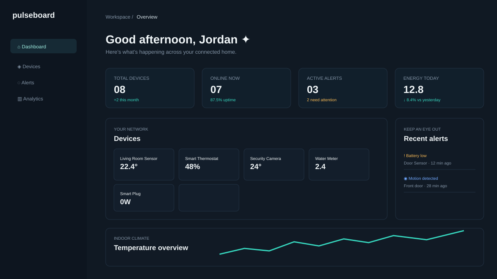

# Pulseboard - Smart IoT Device Monitoring Dashboard

[](https://developer.mozilla.org/en-US/docs/Web/HTML) [](https://developer.mozilla.org/en-US/docs/Web/CSS) [](https://developer.mozilla.org/en-US/docs/Web/JavaScript) [](LICENSE)

A polished, responsive smart-home operations dashboard for monitoring connected devices, climate signals, power consumption, and system alerts at a glance.

**[View the live demo](https://242ta02014-alt.github.io/Smart-IoT-Device-Monitoring-Dashboard/)

## Screenshot



## Features

- Dark, high-contrast dashboard interface designed for fast scanning.
- Responsive device grid with online, warning, and offline states.
- Simulated live sensor readings that refresh every four seconds.
- Canvas-rendered temperature line chart and energy usage bar chart with no chart libraries.
- Dismissible alert notifications with live alert counts.
- Responsive mobile navigation drawer and layout.
- Semantic HTML and accessible labels for buttons, controls, and charts.

## Tech Stack

- HTML5
- CSS3 with custom properties, Grid, Flexbox, and responsive media queries
- Vanilla JavaScript (ES6+)
- HTML5 Canvas API
- Google Fonts: DM Sans and Space Grotesk

## Setup

No build step or package manager is required.

1. Clone or download this repository.
2. Open `index.html` in a browser, or serve the folder with any static server.
3. For a local server with Python, run `python -m http.server 8000` and visit `http://localhost:8000`.

## Folder Structure

```text
iot-dashboard/
├── index.html
├── css/
│   └── style.css
├── js/
│   └── script.js
├── assets/
│   └── images/
│       └── dashboard-preview.svg
├── .gitignore
├── LICENSE
└── README.md
```

## Author

**kavitha**

Replace the links below with your own portfolio and contact details before publishing.

- GitHub: [@your-username]https://github.com/242ta02014-alt
- LinkedIn: [Your LinkedIn]https://www.linkedin.com/in/seluvugari-kavitha-7487623aa?utm_source=share_via&utm_content=profile&utm_medium=member_android
- Email: [242ta02014@ashokacollege.in)

## License

This project is available under the [MIT License](LICENSE).
